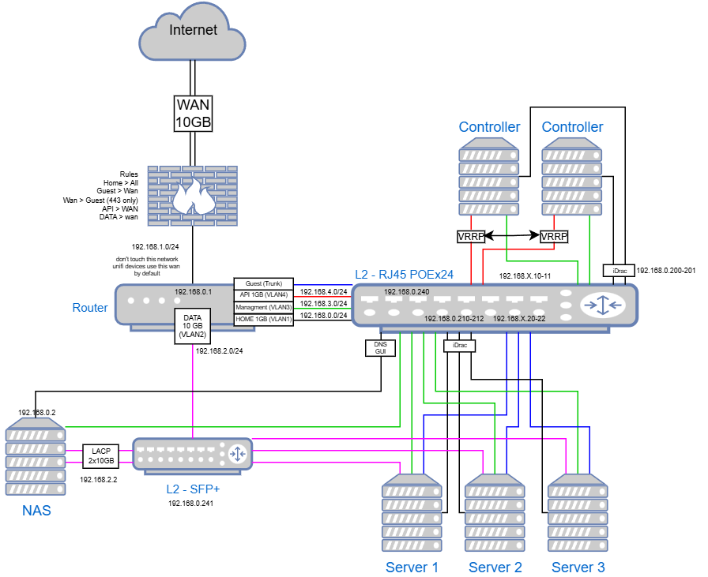

<!-- BEGIN_TF_DOCS -->
# Terraform - Servers Configurations

This Terraform provides secure and scalable infrastructure automation for **Dell server configuration** using Redfish API with **HashiCorp Vault integration** for credential management.

## Features

- ✅ **Automated Dell server provisioning** via Redfish protocol
- ✅ **BIOS configuration management** with sequential workflow (disable PXE → RAID → enable PXE)
- ✅ **Secure credential management** through HashiCorp Vault integration
- ✅ **Multi-server fleet deployment** with individual hardware customization
- ✅ **Power management automation** (graceful shutdowns, force restarts)
- ✅ **Asset management integration** with custom tags and naming
- ✅ **Error handling and retry logic** for transient failures
- ✅ **Comprehensive validation** for all configuration parameters

## Prerequisites

### Software Requirements
- **Terraform** >= 1.3.3
- **Terragrunt** >= 0.80 (optional, for enhanced workflow)
- **HashiCorp Vault** cluster with AppRole authentication configured

### Infrastructure Requirements
- **Dell servers** with iDRAC >= 9/Redfish protocol enabled
- **HashiCorp Vault** with the following secrets configured:
  - `secrets/backbone/idrac_root/<server_name>` - iDRAC root credentials (user/password)
  - AppRole authentication method enabled
- **Consul backend** (optional) for remote state management

## Architecture

# Overview

This project use redfish-server module to configure each Dell server with idrac

### **Security Features**
- **Vault Integration**: All credentials stored and retrieved securely from HashiCorp Vault
- **AppRole Authentication**: Automated, secure authentication without human intervention
- **Sensitive Variable Protection**: All passwords and secrets marked as sensitive
- **TLS Configuration**: Production-ready TLS settings for Vault communication

### **Operational Excellence**
- **Error Handling**: Automatic retry for transient failures (network timeouts, API limits)
- **State Management**: Consul backend for team collaboration and state persistence
- **Comprehensive Validation**: Input validation for all parameters with clear error messages

### **Flexibility & Scalability**
- **Multi-Server Support**: Deploy single servers or entire rack fleets
- **Hardware Customization**: Per-server configuration
## Requirements

| Name | Version |
|------|---------|
|  [terraform](#requirement\_terraform) | >=1.3.3 |
|  [redfish](#requirement\_redfish) | >=1.6.0 |
## Providers

| Name | Version |
|------|---------|
|  [vault](#provider\_vault) | 5.3.0 |
## Inputs

| Name | Description | Type | Default | Required |
|------|-------------|------|---------|:--------:|
|  [login\_approle\_role\_id](#input\_login\_approle\_role\_id) | Vault AppRole Role ID for automated authentication | `string` | n/a | yes |
|  [login\_approle\_secret\_id](#input\_login\_approle\_secret\_id) | Vault AppRole Secret ID (rotate regularly) | `string` | n/a | yes |
|  [servers](#input\_servers) | Map of server configurations for the complete rack deployment | <pre>map(object({     endpoint     = string     ssl_insecure = bool     server_name  = string     asset_tag    = string      hardware = object({       storage = object({         controller_id         = string         drives                = list(string)         raid_type             = string         volume_name           = string         read_cache_policy     = string         write_cache_policy    = string         disk_cache_policy     = string       })              boot = object({         boot_order = string       })     })   }))</pre> | n/a | yes |

## Modules

| Name | Source | Version |
|------|--------|---------|
|  [redfish\_servers](#module\_redfish\_servers) | ../_modules/redfish-server | n/a |
## Roadmap

- [ ] Add servers

## Support

Need help? Here's how to get support:

1. 📖 Check the [complete documentation](./docs/)
2. 🐛 Report bugs by opening an [issue](https://github.com/Astocanthus/low-layer-platform/issues)

## Authors

Maintained by [Astocanthus](https://github.com/Astocanthus) with ❤️

## Changelog

See [CHANGELOG.md](./CHANGELOG.md) for detailed version history and breaking changes.

---
**Note**: This project is actively maintained. For questions about enterprise support or custom implementations, please contact us at [support@your-org.com](mailto:contact@low-layer.com).
<!-- END_TF_DOCS -->